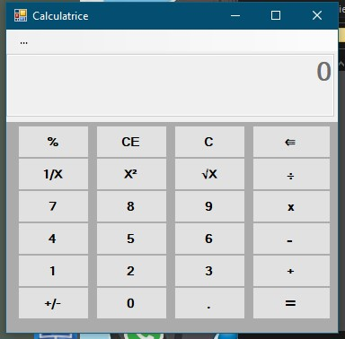
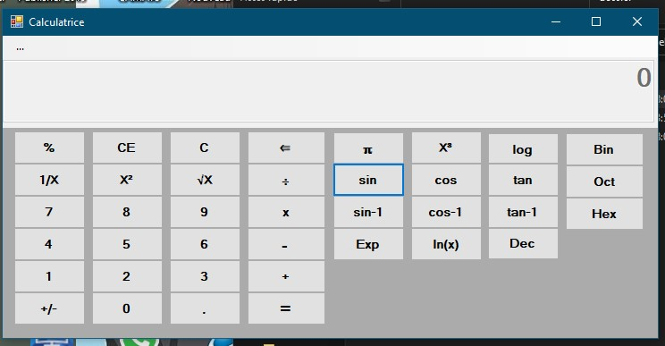

# 🧮 Calculatrice Scientifique - Windows Forms (C#)

Une application de **calculatrice scientifique** réalisée en **C#** avec Windows Forms via **Visual Studio Code**, en utilisant une extension permettant la création d'interfaces graphiques (WinForms).

Cette application propose deux modes :
- **Standard** : opérations classiques (+, −, ×, ÷, %, √, etc.)
- **Scientifique** : fonctions trigonométriques, logarithmes, puissances, conversions binaires...

## 🧰 Technologies utilisées

- Visual Studio Code
- C#
- Windows Forms (WinForms via extension pour VS Code)

## 🧭 Fonctionnalités

- Mode standard avec les opérations de base
- Mode scientifique avec :
  - Fonctions trigonométriques : sin, cos, tan (et inverses)
  - Puissances et racines
  - Fonctions log, ln, exponentielle
  - Conversions : binaire, octal, décimal, hexadécimal
- Interface claire et intuitive
- Gestion des erreurs de calcul

## 📸 Interface

| Mode Standard | Mode Scientifique |
|---------------|--------------------|
|  |  |

*(renomme les images et ajoute-les au repo, ou utilise celles que tu m’as envoyées)*

## 🚀 Lancer le projet

1. Cloner ce dépôt
2. Ouvrir dans Visual Studio Code
3. Lancer via une extension WinForms compatible (ex. : .NET Framework / .NET 5+ selon le setup)

## 📌 Ce que j’ai appris

- Utilisation de Windows Forms dans un environnement léger comme VS Code
- Conception d’interfaces utilisateur simples et fonctionnelles
- Manipulation des événements et des fonctions C# pour les interfaces graphiques
- Gestion des modes dynamiques (standard ↔ scientifique)

## 🚧 Statut

Projet fonctionnel — terminé ✅
